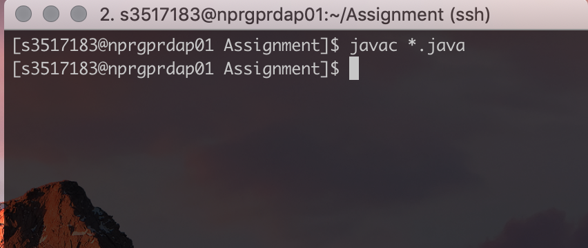

# COSC1176/1179 - Network Programming Assignment (Semester 1, 2019)


## Content Links

[TOC]


##Guess Game   MultiPlayer Version


###Game Rules

- Launch Server.java first, then launch many Client.java
- If no one to register, Server keep alive to wait.
- Register name must at least three letter.
- Once connect to Server, the first step is registering name, and then allow to join playing queue.
- Once the 1st player register name, Server will start the first round game in 5 mins
- Each round, the server will take the first three players to playing queue. If not reach three player, will take the rest players. One player also allow to play.
- Each round, the max playing time is 5 mins
- Each round, the server create a random number from 0 to 9
- Each round, players can play at the same time
- Each round, players have at most 4 times to guess, if guess wrong, player will be informed of clue.
- During game, players can enter e to exit from game
- If all players complete the guess or timeout, the related players will receive notification of ranking.
- Ranking only include who complete game correctly and ranking by win date time and guess times, exit from game means discard ranking.
- After round came over, the players can q to quit game or p to join playing queue.
- During game time, other players can connect to server and register to playing queue.
- If a player don't communicate with Server in 30 mins, the player will disconnect from Server.


### Modules and Classes


#### Server

| Classes                | Description                                                  |
| ---------------------- | ------------------------------------------------------------ |
| Server.java            | Main method<br />Main method will listen for client connect<br />Create three threads<br />- One for handling player guess process<br />- One for hold on all round game process<br />- One for shutting down server |
| HandleMultiClient.java | When each player register successful, Server will<br />generate this thread for them. Mainly handle guess logic.<br />Such as how much time this player has guess |
| HandleGameProcess.java | This thread is for managering all others player thread,<br />and control when to start game, to end game, <br />to release ranking |
| ServerShutDown.java    | This thread is used to shut down server<br />there is a scanner to check if input is 'q'<br />if is 'q', the first step is to tell all client to close their resource<br />and then to close server related resources. |
| LoggerFormatter.java   | As using java.util.logging.Logger, the logger format <br />is xml which is not easy to read.<br />So this class is to make logger readability |


####Client

| Classes                | Description                                                  |
| ---------------------- | ------------------------------------------------------------ |
| Client.java            | Main method<br />Create two threads<br />One is for Receiving Message from Server<br />Other is for Send Message to Server |
| ReceiveFromServer.java | Handle the msg from Server<br />Such as setting isRegister, isStart state |
| SendToServer.java      | According to different state to handle user input<br />Such as to check if player is registering, will not allow to join<br />playing queue if not register. |


###Execution

Following below step to run command, not allow skip to execute

- Change Client.java address
  - Go to where you put Server.java, typing 'ifconfig' in terminal to check IP 
  - Copy this IP and go to Client.java to change IP
  - See below screenshot - client_bind_to_server, paste IP to replace 'localhost'

- Complie by follow command:

  ```java
  javac *.java
  ```

- Run in seperate terminals:

  - Server terminal

    - ```java
      java Server.class
      ```

  - Client terminal

    - ```java
      java Client.class	
      ```

- Use ``q`` + ``Enter``to quit from game **anytime**

  ```java
  q
  ```

- Use ``e`` + ``Enter`` to exit from game **only** when playing game

  ```
  e
  ```

- Use ``p`` + ``Enter`` to join play queue **only** after complete game

  ```
  p
  ```

  

###ScreenShots

##### screenshot - client_bind_to_server

 

##### screenshot - lauch in netprog1 and netprog2

lauch Server.java and Client.java

> Server is in netprog1

> Three clients in netprog1

> Four clients in netprog2

 

#####screenshot - 7 players in pending queue

 

#####screenshot - 3 players complete 1st round

 

#####screenshot - 3 players complete 2nd round

 

#####screenshot - 1 player complete 3rd round

 

##### screenshot - player quit from game anytime

 

##### screenshot - player play game again

 


###Sequence Diagram

#####screenshot - Server.serverGame

This is used to lauch server 

  


##### screenshot - HandleMultiClient

Create a thread for each connect player


##### screenshot - HandleGameProcess

Server create a thread that control game process, such as when to start game, release ranking.


##### screenshot - ServerShutDown

> This function is not considered in assignment requirement, but I would like to implemente.

> Server will create a new thread to scanning console input, if enter q, server will tell all client and then close server related resources.


##### screenshot - Client.gameStart

lauch client, it will create two threads, one for send msg, other for receive msg


##### screenshot - SendToServer

This thread is responsible for sending msg by DataoutputStream.

> Before sending msg, client will check if meet sending requirment, such as in guessing period, it is only allowed to send number from 0 to 9, and letter e to exit from game.


##### screenshot - ReceiveFromServer

This is used to read msg from server. one of important func is that when receive letter 'q' which means the server ask client to quit now.


### Author

Xiaoyu Chen from RMIT

---

End

